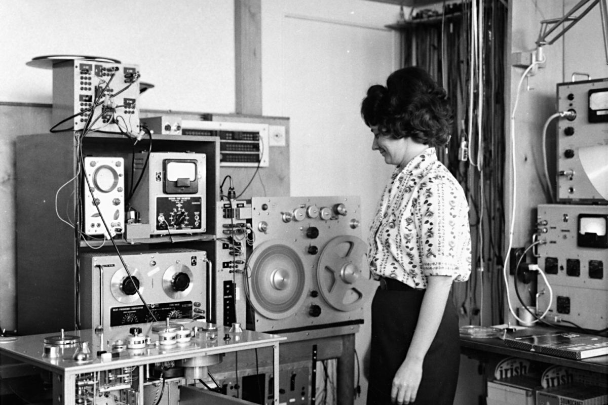

# Else

A collection of useful and/or strange pattern classes for SuperCollider.

These classes are basically just things I need(ed) for my own composition work and as such they are a work in progress and will continually change/grow.

# Installation

To install, open up SuperCollider and evaluate the following: `Quarks.install("https://github.com/madskjeldgaard/Else")`

# The name
Named after the great Danish composer Else Marie Pade for no particular reason other than the fact that she's a hero.
